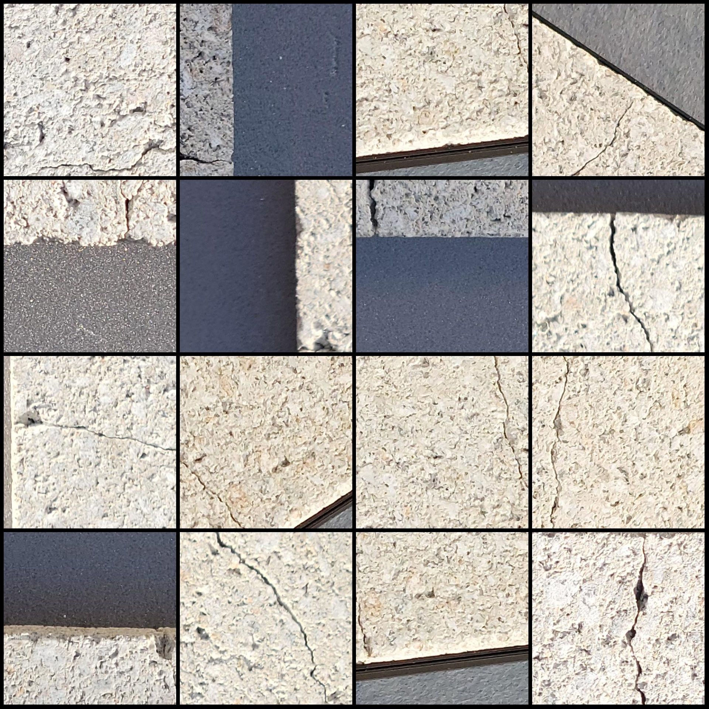
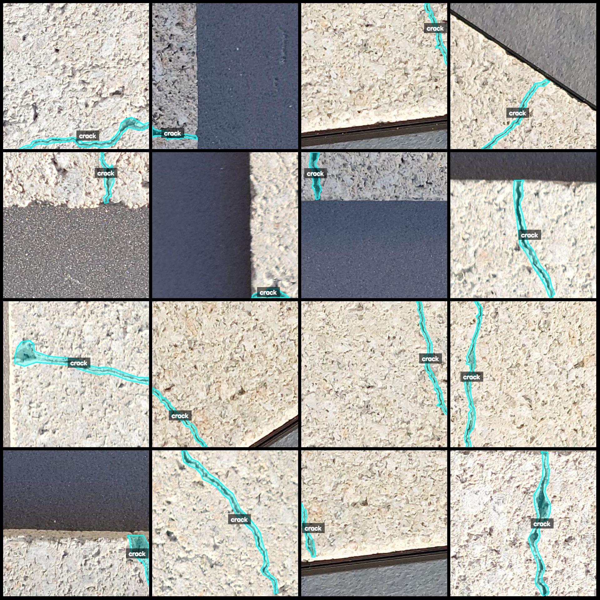
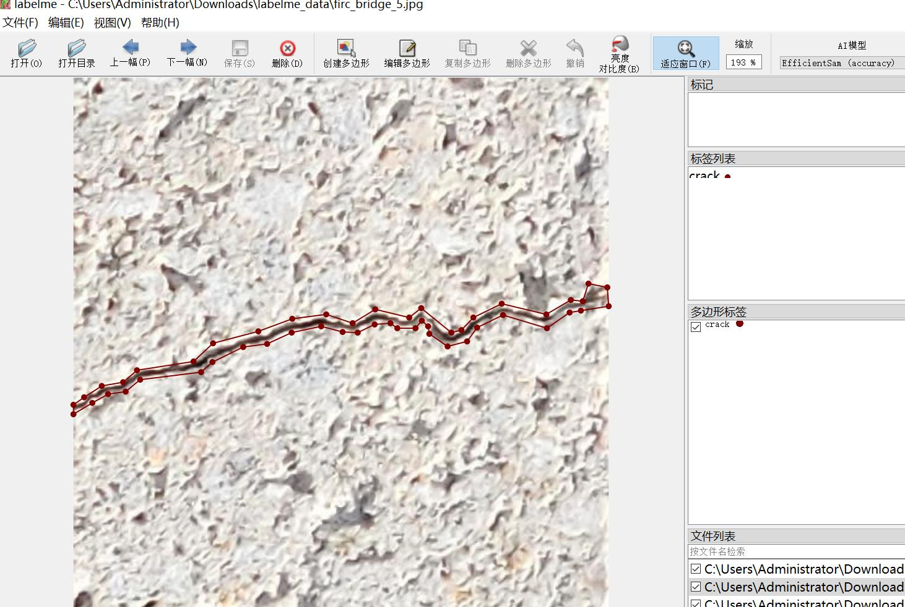

# Bridge Crack Segmentation Dataset in labelme Format with 2181 Images, 1 Category

The dataset format is: labelme (excluding mask files, only containing JPG images and the corresponding JSON files).  
Number of images (JPG file counts): 2181  
Number of annotations (JSON file counts): 2181  
Number of categories: 1  
Category name for annotations: "crack"  
Number of bounding box instances per category:  
crack count = 2217  
Total number of bounding boxes: 2217  
Labeling tool used: labelme version 5.5.0  
Image resolution: 448x448  
Annotation rules: Polygons are drawn around categories  
Important Notice: The dataset can be edited using labelme, but the JSON data set must be converted into either mask or yolo/coco format for instance segmentation or semantic segmentation.  
Special Disclaimer: This dataset does not guarantee the accuracy of any trained models or weight files.  
Image Preview:  
Annotation examples:  
Randomly selected 16 images for annotation:  
Annotation drawing results:  
Labelme editing image example:

## Images

Here is a pay link on Stripe ( https://buy.stripe.com/3cs8yP7sY87d0vu9AB ). Please contact me lonlonago@foxmail.com after funding $89, and I will send you a complete data files , thank you!

